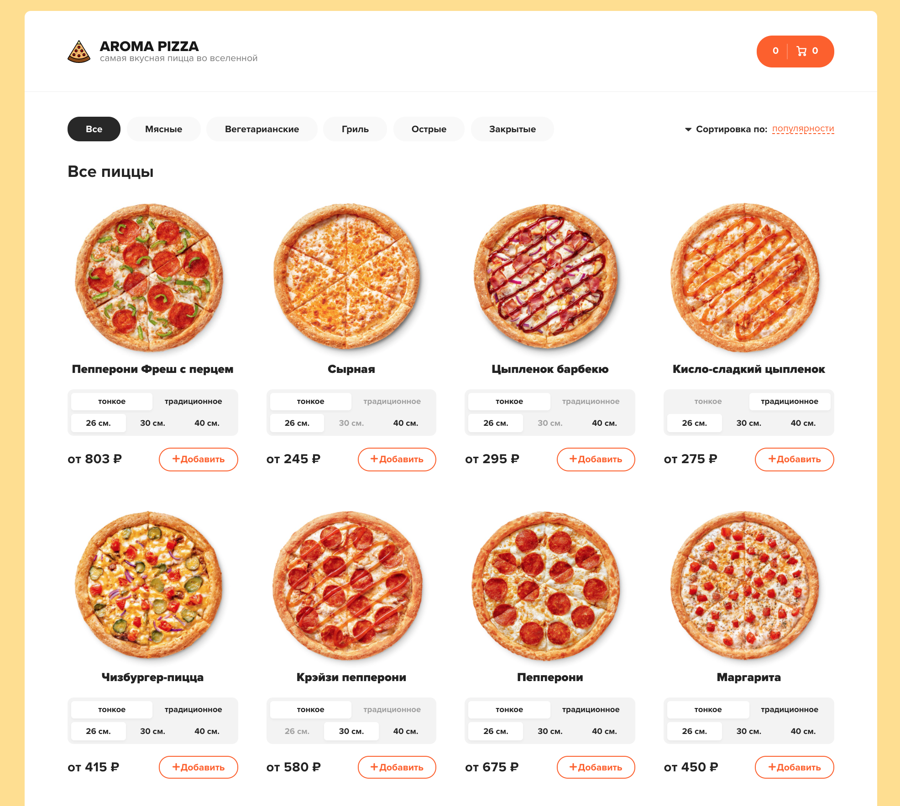
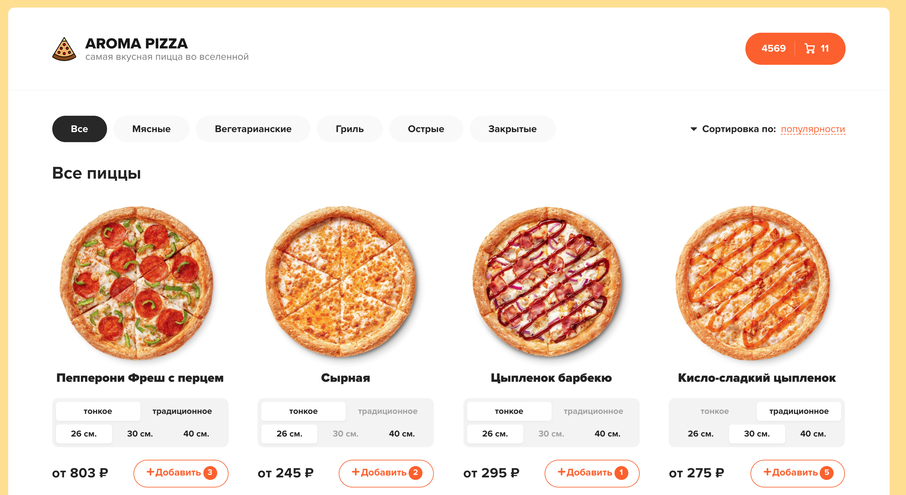
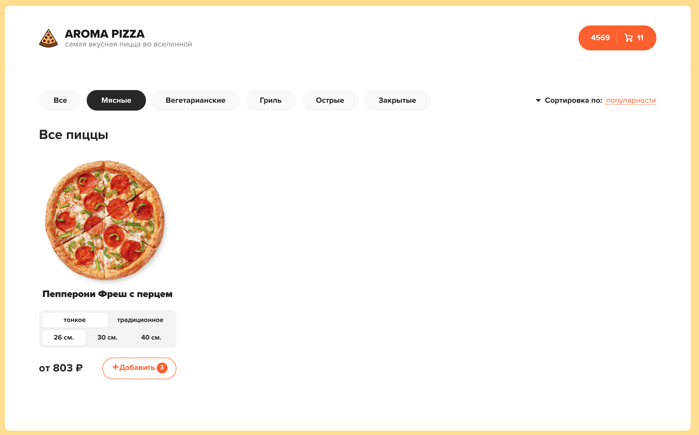
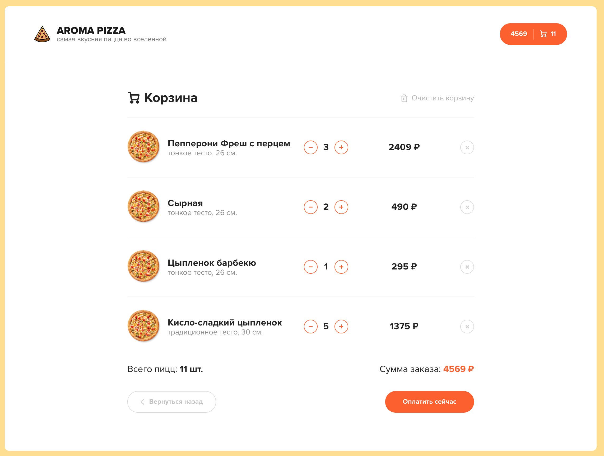

# Aroma-Pizza ([Demo](http://aroma-pizza.herokuapp.com/))
_Project purpose: learn how to use Redux, Redux-Thunk, Axios_

## Functionality
+ Pizzas filtering
+ Choosing pizza options
+ Adding pizzas to the cart
+ Sign out

## Technologies

+ React
+ React Hooks
+ React Router
+ Redux
+ Redux-Thunk
+ Json-server (fakeAPI)
+ Axios
+ Classnames
+ SASS

### Main page

### Pizzas added to the cart

### Filtered pizzas

### Cart

